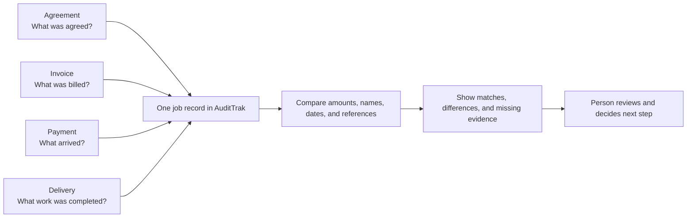
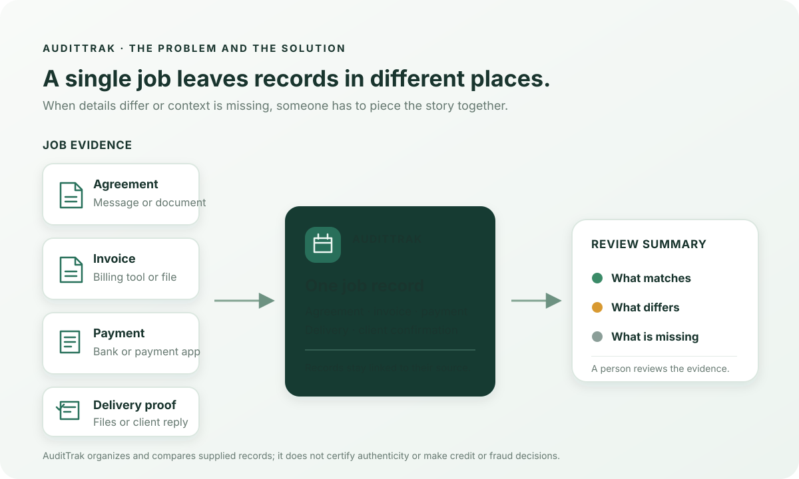

# AuditTrak

**Money moved. AuditTrak shows the story behind it.**

A workspace for freelancers and small businesses to bring a job’s agreement, invoice, payment, and delivery records together, see where they match, and share the evidence with a human reviewer.

## The problem AuditTrak addresses

For a single job, the agreement may live in a message or document, the invoice in another tool, and the payment in a bank or payment app. When the amounts, names, references, or dates do not line up, the business has to gather the records and work out what happened. Missing context can make a normal change or part payment look unclear.

AuditTrak creates one record for the job, links its evidence, compares the supplied details with fixed rules, and explains matches, differences, and missing items. The business owner or reviewer decides what those findings mean.





## Deploy to Vercel

Use the step-by-step guide in [`docs/DEPLOY-TO-VERCEL.md`](docs/DEPLOY-TO-VERCEL.md). Set `DATABASE_URL` to a pooled PostgreSQL connection and `COOKIE_SECURE=true`. The hosted backend uses PostgreSQL for persistent accounts, sessions, records and evidence. Local development can still use SQLite.

## Run it

Requires Node **24.x** (uses Node SQLite). SQLite may print an experimental-feature notice on Node 22.

```bash
npm ci
npm run build
npm start
```

Open http://localhost:3000 and create a workspace. Add a job, then enter its agreement, invoice, payment, and delivery details. Attach source records when available, run the assessment, and review the reasons before sharing it.

Environment settings are described in `.env.example`. Supply them through your shell/process manager; this service does **not** automatically load `.env` files.

## Included

- Business sign-up/login, saved profile, tenant separation, cookie sessions and sign-out.
- Commercial events, counterparties, agreements, invoices, multiple payment records, fulfillment and evidence files (up to 3 MiB).
- Confirmation links tied to an event revision; one response per invitation; 14-day expiry. No messages sent automatically. Link possession does not verify identity.
- Deterministic amounts, currencies, names, references, timing, net credits/debits, missing delivery and confirmation checks.
- Evidence graph, timeline, activity log, commercial activity profile, explicit sharing/revocation and a reviewer workspace.
- Optional Mono import and AI extraction provider boundaries, separate from manual records.
- A walkthrough presentation, a pitch deck/script, and fictional test fixtures in `docs/` and `data/`.

## Architecture

React + Vite UI → Fastify TypeScript API → SQLite database.

`src/mvp/db.ts` defines the evidence model and persistence; `routes.ts` enforces ownership and reviewer access; `assessment.ts` assembles five-stage assessments using `src/reconcile.ts`. `ui/main.tsx` contains the user flow. The earlier three-record prototype remains at `/prototype`; its `/api/*` routes are learning utilities with an in-memory store, separate from the persisted `/api/v1` workspace.

See [`docs/local-database.md`](docs/local-database.md) for what the local SQLite file stores, how sign-in and event records persist, and what remains before online hosting.

Money is stored in integer **minor units**. Currencies are never converted or summed across currencies. Differences are review signals; they do not establish wrongdoing. A debit is subtracted only when the user links it to the job, and its relationship still needs review.

## Optional providers

**Mono:** `MONO_SECRET_KEY` enables the adapter. An operator must obtain user consent through their own Mono setup and set `MONO_ACCOUNT_BINDINGS` to map a workspace business ID to that consented account ID. POST selected transaction IDs to `/api/v1/events/:id/mono-import`; the service fetches that bound account and links only returned records. Duplicate transaction IDs within a business are rejected. No consent widget, OAuth flow, live bank connection, automatic reconciliation or live sandbox validation is claimed. See `docs/API.md`.

**Extraction:** set `DOCUMENT_EXTRACTION_URL` and optionally `DOCUMENT_EXTRACTION_API_KEY` for an HTTP service implementing `src/extraction.ts`. Attach an agreement/invoice and paste its text into the proposal form. Results must identify the same attached document and include excerpts present in submitted text. The UI shows proposals for manual review. There is no built-in OCR, trained model or configured AI provider. Excerpts alone do not prove the proposed values are correct.

Legacy provider endpoints require `PROVIDER_ACCESS_TOKEN` as a bearer token when configured. Prefer the authenticated event routes. Never commit credentials or bank account bindings.

## Guardrails and limits

No invented evidence, credit decisions, fraud labels, or AI overrides of deterministic rules. Summaries are templates over supplied records. Name similarity is a signal, not identity verification. The legacy `evidenceConfidence` number is an uncalibrated input-based heuristic; the MVP shows explicit evidence coverage and uncertainty instead.

This is a **local MVP**, not a production financial system. Before an external pilot: HTTPS and secure cookies, explicit reviewer/institution grants (all seeded reviewers currently see all shared jobs), account recovery/verification, operational rate limits, file scanning, retention/deletion policy, encrypted backups, database migrations and a production security review are needed. Uploaded files are downloaded as attachments; their content is not authenticated. Audit history is application-level, not tamper-proof. Deleting a job removes its evidence while retaining action history.

## Checks

```bash
npm run build
npm run typecheck
npm test
```

Tests cover the deterministic engine, demo scenarios, API validation, normalization, business separation, sharing, confirmation invalidation, persistence, reversal handling and built UI assets. The tests mock providers; real account/provider behavior is not validated.
