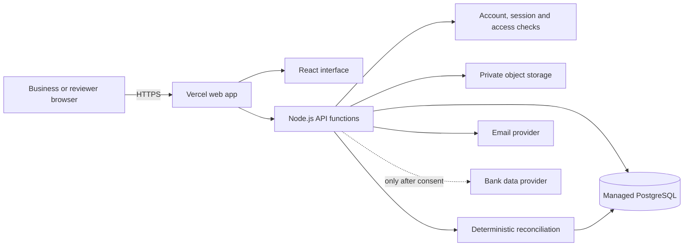

# AuditTrak online MVP plan

Updated 9 October 2026

## Product in one sentence

AuditTrak gathers records for one business job, compares what was agreed, billed, paid, and delivered, then explains what matches or needs a person to review.

## The problem we are solving

Evidence for a business transaction can be spread across messages, agreements, invoices, payment records, and delivery records. A person has to find the records, connect them, clean inconsistent names and references, and explain what is missing. The MVP organizes those records into one event and applies transparent deterministic checks.

## What the MVP does

1. A business creates an event for a job or transaction.
2. The business records or uploads agreement, invoice, payment, and delivery evidence.
3. AuditTrak normalizes comparable fields and checks amounts, currencies, parties, dates, references, duplicates, and missing evidence.
4. The app shows matching evidence, conflicts, warnings, evidence confidence, and why a reviewer should look closer.
5. A human reviews the result and can request confirmation or share the record with an explicitly authorized reviewer.

AI may suggest fields from a document in a separate step. Suggestions must point back to the source and wait for human confirmation. AI does not invent evidence or change deterministic outcomes. AuditTrak does not make credit decisions or assign fraud labels.

## Proposed online shape

Vercel is the proposed web host, not yet connected or deployed. The existing project is a Vite/React UI plus one long-running Fastify server. We need to adapt the API to Vercel's Node.js function model. We also need to replace local SQLite persistence: Vercel function storage is read-only apart from temporary `/tmp` space. A managed PostgreSQL provider from the Vercel Marketplace is the proposed record store. Private object storage holds files; the database keeps metadata and access links.

## Work plan

### Phase 1: make the application deployable

- Split the React build and API runtime cleanly for Vercel.
- Adapt API handlers and static routing. Preserve existing business rules and screen flows.
- Move the data layer from synchronous SQLite calls to PostgreSQL and add versioned migrations.
- Move uploaded evidence to private object storage with authorized access and size/type checks.
- Disable the legacy sample route in production.

**Complete when:** preview builds open the app, API routes respond, and records/files persist across fresh function instances.

### Phase 2: minimum account and privacy controls

- Add email verification, password reset, email-change confirmation, and session revocation.
- Require explicit, revocable reviewer grants for each event.
- Add account export/deletion, evidence retention, shared rate limits, audit events, and privacy notice.
- Set production cookies Secure, HttpOnly, and SameSite. Keep provider keys only in server-side environment settings.
- Add private file scanning, encrypted backup, restore instructions, and monitoring.

**Complete when:** a business can only access its own data, reviewers see only granted events, and account/data lifecycle actions are usable.

### Phase 3: preview and release process

- Connect the existing GitHub repository to the user-selected Vercel account.
- Use automatic preview deployments for reviewed changes and a separate production environment.
- Add a deployment checklist for build, account creation, event creation, persistence, permissions, uploads, and rollback.
- Confirm the account's plan, provider costs, database region, backup retention, and domain before production setup.

**Complete when:** the owner can review a preview URL, understand the cost and data location, and release a chosen commit to production.

### Phase 4: limited pilot

- Start with a small number of invited users and synthetic or low-sensitivity records.
- Monitor reliability, error reports, rate limits, restore readiness, and support requests.
- Keep bank imports disabled until a provider's consent flow and data scope are implemented and reviewed.
- Add document extraction only as a source-linked human-confirmed proposal.

**Complete when:** the team can support the service, restore data, answer deletion requests, and explain every reconciliation result.

## Decisions to confirm before hosting resources are created

- Which Vercel account or team owns the project?
- Which plan is appropriate for the intended use? Vercel Hobby is limited to personal, non-commercial use; review current terms and costs.
- Which PostgreSQL and private file-storage providers should hold user data?
- Which email sender and verified domain should deliver account messages?
- Who owns security alerts, backup checks, user requests, and incident response?

These are account, billing, data-location, and operational choices. The plan and slides can be prepared before them. No hosting account, paid service, database, email provider, or bank connection has been created here.

## Near-term order

1. Confirm hosting account, intended use, and cost ceiling.
2. Implement PostgreSQL persistence and API deployment shape.
3. Implement account lifecycle and explicit reviewer authorization.
4. Implement private file handling, backups, and operational visibility.
5. Publish a private preview for the owner to review.
6. Resolve security and privacy gaps before inviting real users.

## Official Vercel references

- [Node.js runtime](https://vercel.com/docs/functions/runtimes/node-js)
- [Function filesystem behavior](https://vercel.com/docs/functions/runtimes)
- [Postgres through Marketplace](https://vercel.com/docs/marketplace-storage)
- [Hobby plan and use limits](https://vercel.com/docs/plans/hobby)
