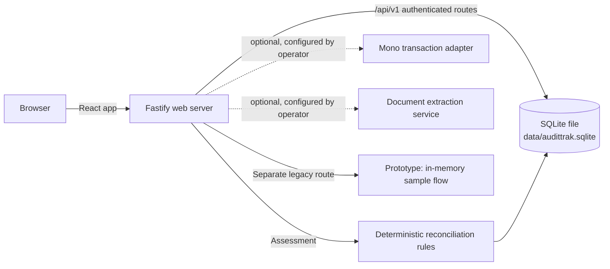
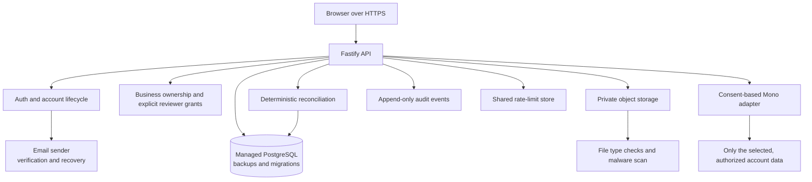

# AuditTrak MVP system design

## What exists today

The authenticated `/api/v1` workspace writes accounts, business profiles, jobs, agreements, invoices, payment records, uploaded evidence, assessments, and audit entries to SQLite. By default the database path is `data/audittrak.sqlite`; `AUDITTRAK_DATABASE` can override it. This file is on the server machine. It is not the GitHub repository, and pushing code does not back up or publish user records.

Passwords are stored as scrypt hashes. Session values are random, stored as hashes server-side, and sent as HttpOnly/SameSite cookies. Sessions last seven days. The `Secure` cookie flag is only set when `COOKIE_SECURE=true`. Business event routes check ownership by business. Uploads are stored as bytes in SQLite. Reconciliation is deterministic; a person reviews differences.

`/prototype` is a separate learning/demo path whose sample evidence lives in memory. It is not the place for real user accounts or durable business records. Use the authenticated workspace for saved records.

## Pilot target

### Account and onboarding flow

1. Sign-up creates a **pending** account and business, but does not create a usable session.
2. The server creates a cryptographically random, single-use, expiring verification token; only its hash is stored.
3. The email service sends a verification link. The link returns to the app; the server checks the token, marks the address verified, consumes the token, and starts the session.
4. A skippable two-step onboarding asks for a work category and whether jobs usually come through a marketplace, direct clients, or both. Save these as optional business preferences, then take the user to “Create your first job.”
5. Add password recovery using its own single-use, expiring token flow. Use the same response whether an email is registered or not, and rate-limit sending and attempts.

Email verification confirms access to an inbox. It is not multi-factor authentication. Add authenticator/passkey MFA before enabling higher-risk actions such as connecting bank data or changing account security settings.

### Data ownership and evidence flow

- Every business-owned record carries a `business_id` or links to a job whose owner is checked on every request.
- A reviewer sees a job only after the business explicitly grants access. A review grant identifies the reviewer, job, scope, expiry/revocation state, and audit history.
- Documents live in private object storage, are checked for size, allowed type, and malware, and are served as downloads. Keep provider secrets on the server.
- Bank imports are unavailable until the user completes the provider's consent flow. Import only user-selected transactions; show source and timestamps; never treat a bank connection as proof of a job's purpose.
- Rules create versioned signals and an explanation from supplied evidence. The UI must show missing/contradictory records and source references. AI extraction may suggest fields for human confirmation; it cannot create evidence or override the rules.

## Before real external users

### Must do before a limited pilot

- Deploy behind HTTPS and set Secure session cookies; keep `HttpOnly` and `SameSite` protections.
- Add email verification, password recovery, email-change confirmation, and account/session revocation.
- Replace process-local login throttling with shared rate limits and monitoring.
- Add explicit reviewer grants; remove the seeded reviewer behavior that can see every shared job.
- Add user data export, account deletion, evidence retention rules, and a plain-language privacy notice.
- Protect uploads, keep backups encrypted, and test restore procedures.
- Keep the database on durable storage. For a hosted multi-user pilot, migrate from local SQLite to managed PostgreSQL with migrations and backups.
- Set up production secrets and a documented incident/contact process; complete a security review before handling real bank data.

### Can wait until after the first pilot

- MFA/passkeys, unless bank connections or other high-impact account actions are enabled sooner.
- Additional accounting, marketplace, chat, and payment integrations beyond one consented bank-data path.
- AI/OCR extraction automation. Manual entry and source-linked reviewer-confirmed suggestions are sufficient for the first pilot.
- Cross-business analytics, automatic risk scores, credit decisions, and fraud labels; they are outside this product's intended scope.

## Operating boundary

The current local service is bound to loopback and is not a public hosted service. A live pilot needs a deployed host with durable storage, HTTPS, email delivery, secret management, monitoring, and tested backups. Do not put real customer or bank records in GitHub, in the in-memory `/prototype`, or in an unbacked local database.
